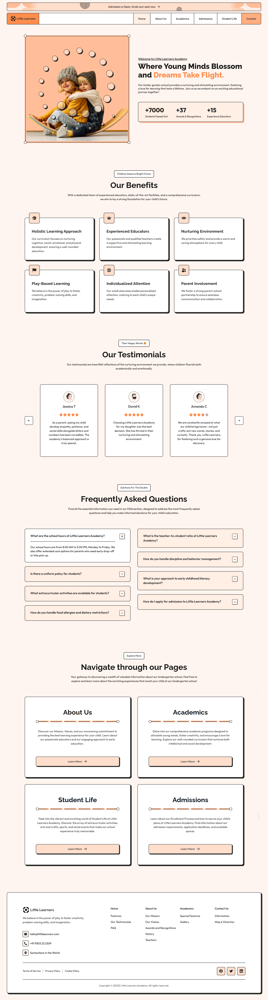

#  🏫 Little Learners

Сайт частной подготовительной школы на  React с использованием языка программирования TypeScript, препроцессора стилей SASS и сборщика проектов Vite.

## 🛠️ Технологии

<div>
    
    
    
    
    
    
    
    
    
    
</div>

## 📸 Скриншоты

### Главная страница



## 🏗️ Архитектура

## 🚀 Быстрый старт

### 1. Клонирование репозитория
```bash
git clone https://github.com/sweetconsole/little-learners.git
```

### 2. Установка зависимостей
```bush 
npm install
```

### 3. Настройка переменных окружения
```bush 
cp .env.example .env.local
# Заполните Supabase ключи
```

### 4. Установка зависимостей
```bush 
npm run dev
```

### 5. Сборка для production
```bush 
npm run build
npm run preview
```